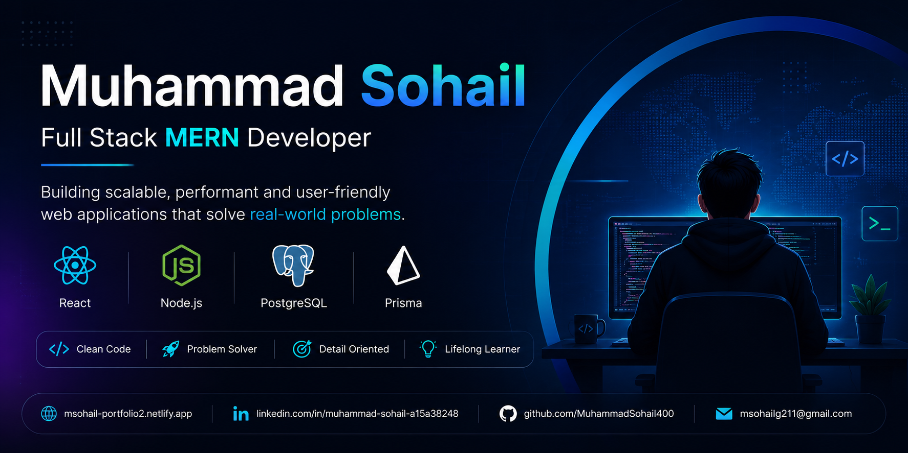

<p align="center">
  
</p>

<p align="center">
  
</p>

<h1 align="center">Hi 👋, I'm Muhammad Sohail</h1>

<h3 align="center">
Backend-Focused Full Stack Developer • Computer Science Student • Problem Solver
</h3>

<p align="center">

</p>

<p align="center">

<a href="https://github.com/MuhammadSohail400">

</a>

<a href="https://github.com/MuhammadSohail400">

</a>

<a href="https://www.linkedin.com/in/muhammad-sohail-a15a38248">

</a>

<a href="https://msohail-personal-portfolio2.netlify.app/">

</a>

<a href="https://leetcode.com/u/YOUR_LEETCODE_USERNAME/">

</a>

</p>

---

# 🚀 About Me

🎓 BS Computer Science Student

💻 Backend-focused Full Stack Developer passionate about building scalable and production-ready web applications.

🌱 Currently Learning

- Advanced Node.js
- TypeScript
- Express.js
- PostgreSQL
- Prisma ORM
- Redis
- Docker
- System Design
- Data Structures & Algorithms

🎯 Career Goal

Become a Backend Software Engineer and build scalable products used by millions of users.

---

# 💻 Tech Stack

## Frontend

<p>

</p>

## Backend

<p>

</p>

## Database

<p>

</p>

## DevOps & Tools

<p>

</p>

---

# 🚧 Currently Working On

### 🛒 ShopSmart AI — E-Commerce Platform

Building a scalable backend using

- TypeScript
- Express.js
- PostgreSQL
- Prisma ORM
- Redis
- JWT Authentication
- RBAC
- Docker
- REST APIs

---

# 📂 Featured Projects

## 🛒 ShopSmart AI — E-Commerce Platform

A production-ready e-commerce backend focused on scalability and clean architecture.

**Features**

- JWT Authentication
- Refresh Tokens
- Role-Based Access Control
- Product Management
- Categories & Brands
- Inventory Management
- Redis Caching
- PostgreSQL
- Prisma ORM
- Docker Ready

**Tech Stack**

TypeScript • Node.js • Express • PostgreSQL • Prisma • Redis • Docker

🔗 Repository:
YOUR_SHOPSMART_REPO

---

## 🎫 Ticket Stub Marketplace

An online ticket marketplace where users can browse events and purchase tickets securely.

**Features**

- User Authentication
- Event Listings
- Ticket Booking
- Cloudinary Image Upload
- Stripe Payment Integration
- Admin Dashboard

**Tech Stack**

MongoDB • Express.js • React.js • Node.js

🔗 Repository:
YOUR_TICKETSTUB_REPO

---

## 🍽 Restaurant POS System

Restaurant Management System with modern dashboard and order management.

**Features**

- Authentication
- Dashboard
- Orders
- Kitchen Management
- Staff Management
- Reports

**Tech Stack**

React • Node.js • PostgreSQL • Prisma ORM

🔗 Repository:
YOUR_RESTAURANT_POS_REPO

---

## 👨‍💼 Employee Management System

A React-based employee management dashboard.

**Features**

- Employee CRUD
- Search & Filtering
- Department Management
- Responsive Dashboard

**Tech Stack**

React.js • JavaScript • CSS

🔗 Repository:
YOUR_EMPLOYEE_REPO

---

# 🧠 Problem Solving

I actively practice Data Structures & Algorithms to improve my problem-solving skills.

### Platforms

- LeetCode
- HackerRank

### Language

- C++

### Current Focus

- Arrays
- Strings
- Hash Maps
- Binary Search
- Sliding Window
- Linked Lists

---

# 📊 GitHub Analytics

<p align="center">


</p>

<p align="center">


</p>

<p align="center">


</p>

---

# 🏆 GitHub Trophies

<p align="center">


</p>

---

# 🎯 2026 Goals

- ✅ Master TypeScript
- ✅ Master Backend Development
- ✅ Learn System Design
- ✅ Learn Docker
- ✅ Learn AWS
- ✅ Solve 300+ LeetCode Problems
- ✅ Build Production-Ready Projects
- ✅ Contribute to Open Source
- ✅ Land a Backend Software Engineer Role

---

# 📫 Connect With Me

📧 **Email**

msohailg211@gmail.com

💼 **LinkedIn**

https://www.linkedin.com/in/muhammad-sohail-a15a38248

🌐 **Portfolio**

https://msohail-personal-portfolio2.netlify.app/

💻 **GitHub**

https://github.com/MuhammadSohail400

🧠 **LeetCode**

https://leetcode.com/u/YOUR_LEETCODE_USERNAME/

---

<div align="center">

## 💭 Favorite Quote

> **"First, solve the problem. Then, write the code."** — John Johnson

⭐ Thanks for visiting my profile! If you like my work, consider starring my repositories.

</div>


```
